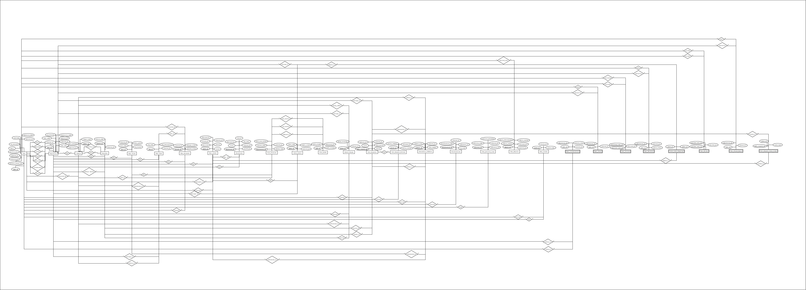
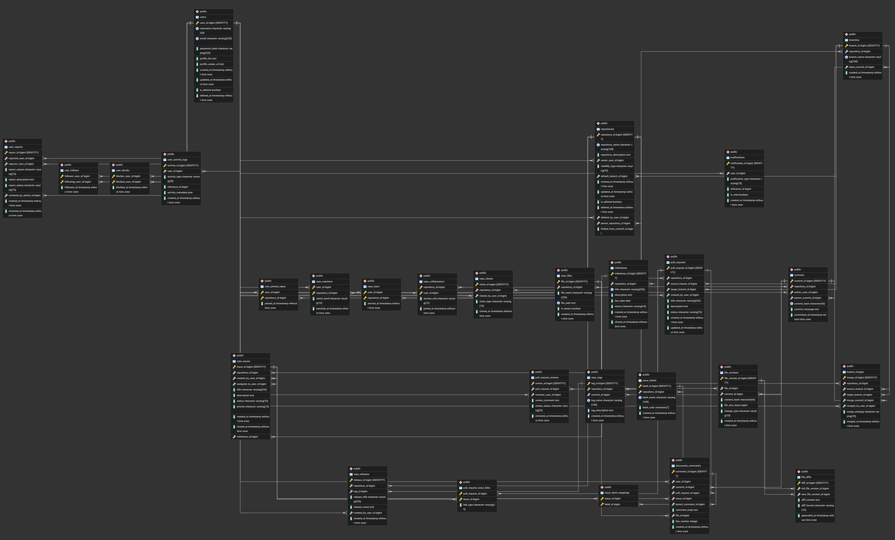

<div align="center">

# 📊 RepoPulse

### A relational database design for a GitHub-style code collaboration platform

[](#)
[](#)
[](#)
[](#)

*Modeling the entire backbone of a Git hosting platform — users, repos, commits, branches, pull requests, issues, and social features — as a clean, normalized relational schema.*

</div>

---

## 🧠 About the Project

**RepoPulse** is a database design case study that reverse-engineers the data model behind a platform like GitHub. It answers the question: *"What would the tables, keys, and relationships look like if you built GitHub's database from scratch?"*

The project covers the full lifecycle of a database design assignment:

- 🗂️ Entity-Relationship modeling
- 🏗️ DDL schema implementation
- 🧮 Formal normalization proofs (1NF → BCNF)
- 🌱 Seed data for testing
- 🔍 A library of real-world analytical SQL queries

---

## 📁 Repository Structure

| File | Description |
|---|---|
| `ERD.jpeg` | Entity-Relationship Diagram of the entire system |
| `Schema.png` | Visual database schema / table relationships |
| `DDL.sql` | Complete `CREATE TABLE` definitions with constraints, keys & relationships |
| `seed.sql` | Sample data to populate and test the schema |
| `SQL_Queries` | Curated analytical queries (top contributors, PR activity, follower graphs, etc.) |
| `normalization.md` | Step-by-step proof that the schema satisfies 1NF, 2NF, 3NF & BCNF |

---

## 🧩 Core Entities Modeled

<table>
<tr>
<td valign="top" width="33%">

**👤 Identity & Social**
- Users
- Follows
- Blocks
- Reports
- Notifications

</td>
<td valign="top" width="33%">

**📦 Repository Core**
- Repositories
- Branches
- Commits
- Files & File Versions
- File Diffs
- Tags & Releases
- Clones

</td>
<td valign="top" width="33%">

**🤝 Collaboration**
- Pull Requests & Reviews
- Issues & Labels
- Milestones
- Discussion Comments
- Stars, Watchers & Pinned Repos

</td>
</tr>
</table>

The schema handles nuanced real-world rules, such as:
- A comment must belong to **exactly one** of a commit, PR, or issue (enforced via `CHECK` constraint)
- Repositories can be **forked**, tracking their parent repo and originating commit
- Merge strategies (`MERGE`, `SQUASH`, `REBASE`) are tracked per branch merge
- Soft deletes for both users and repositories

---

## ✅ Normalization

Every table in RepoPulse is proven to satisfy **1NF, 2NF, and 3NF**, with most relations reaching **BCNF**. A handful of tables (e.g. `repositories`, `branches`, `discussion_comments`) intentionally stop at 3NF where full BCNF decomposition would add complexity without real-world benefit.

📄 Full proofs live in [`normalization.md`](./normalization.md).

---

## 🔍 Sample Queries

A taste of what's inside [`SQL_Queries`](./SQL_Queries):

```sql
-- Top 5 most-starred repositories
SELECT r.repository_name, COUNT(s.user_id) AS stars
FROM repositories r
LEFT JOIN repo_stars s ON r.repository_id = s.repository_id
GROUP BY r.repository_id
ORDER BY stars DESC
LIMIT 5;
```

```sql
-- Most active contributors (commits + repos owned)
SELECT u.username,
       COUNT(DISTINCT c.commit_id) + COUNT(DISTINCT r.repository_id) AS activity_score
FROM users u
LEFT JOIN commits c ON u.user_id = c.author_user_id
LEFT JOIN repositories r ON u.user_id = r.owner_user_id
GROUP BY u.user_id
ORDER BY activity_score DESC;
```

More queries cover follower graphs, PR review status, issue labels, file version history, threaded comments, and repository contributor counts.

---

## 🚀 Getting Started

```bash
# Clone the repository
git clone https://github.com/Raj-PaTel-007/RepoPulse.git
cd RepoPulse

# Create the schema (PostgreSQL)
psql -U your_username -d your_database -f DDL.sql

# Load sample data
psql -U your_username -d your_database -f seed.sql

# Run the analytical queries
psql -U your_username -d your_database -f SQL_Queries
```

> Built with PostgreSQL-specific syntax (`GENERATED ALWAYS AS IDENTITY`, `JSON` columns, `CHECK` constraints).

---

## 🛠️ Tech Stack


---

## 🗺️ Diagrams

| ER Diagram | Schema |
|---|---|
|  |  |

---

## 👤 Author

**Raj Patel**
[GitHub @Raj-PaTel-007](https://github.com/Raj-PaTel-007)

---

<div align="center">

⭐ If you find this schema useful for learning database design, consider giving the repo a star!

</div>
